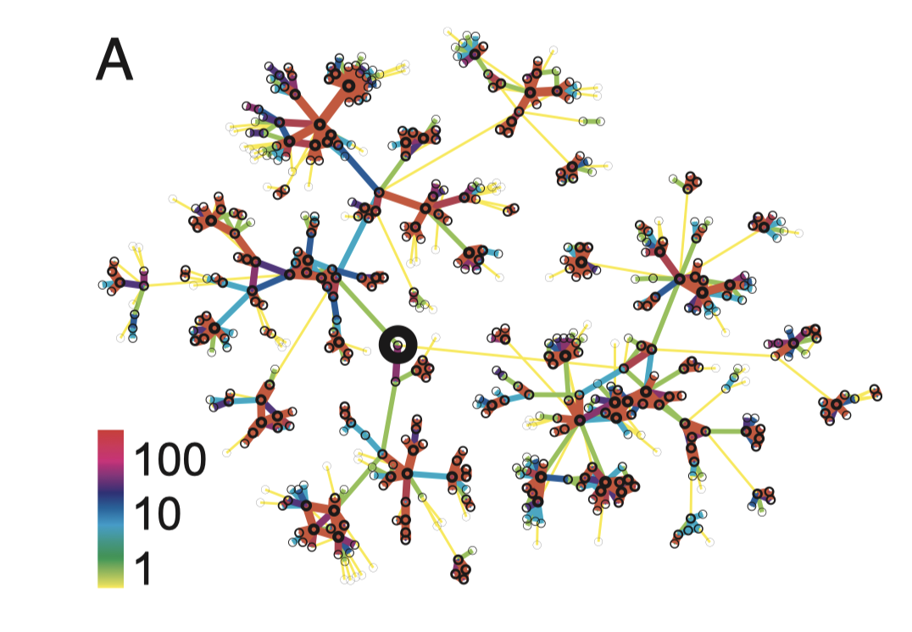
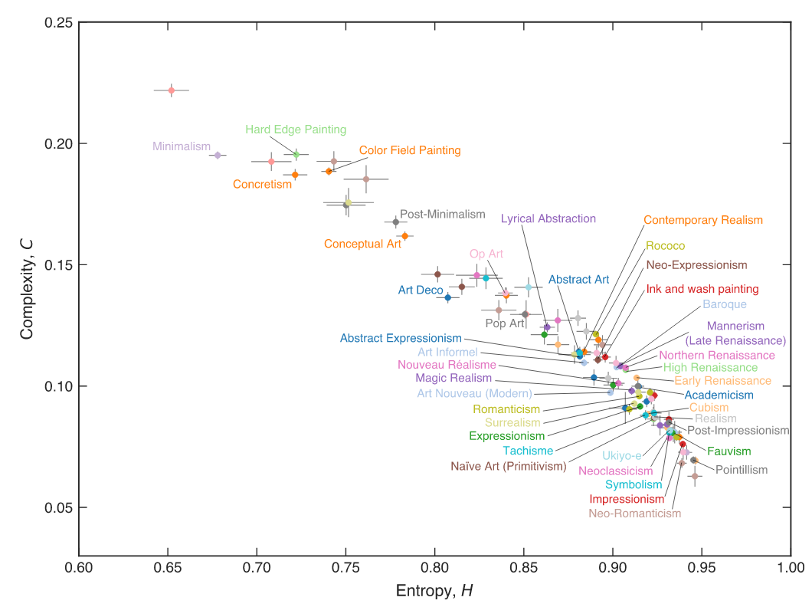
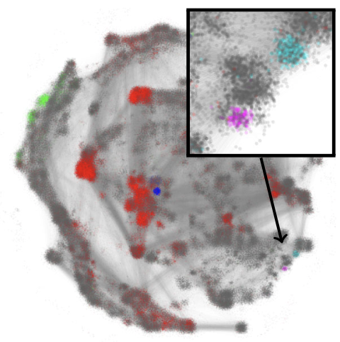
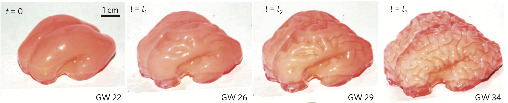
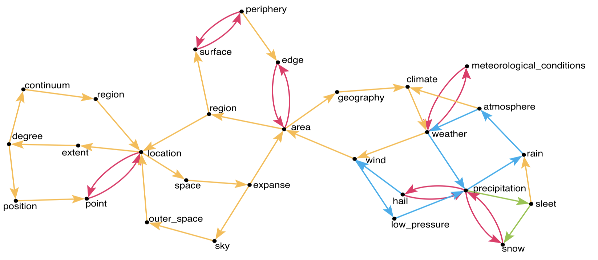
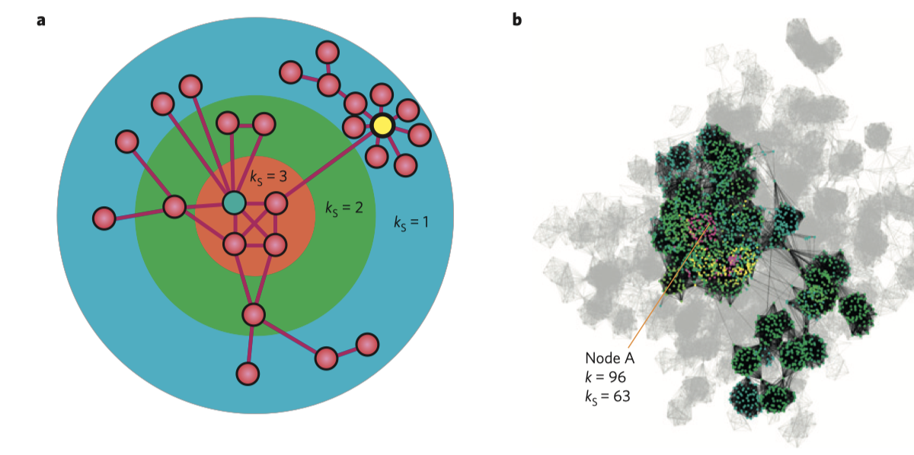
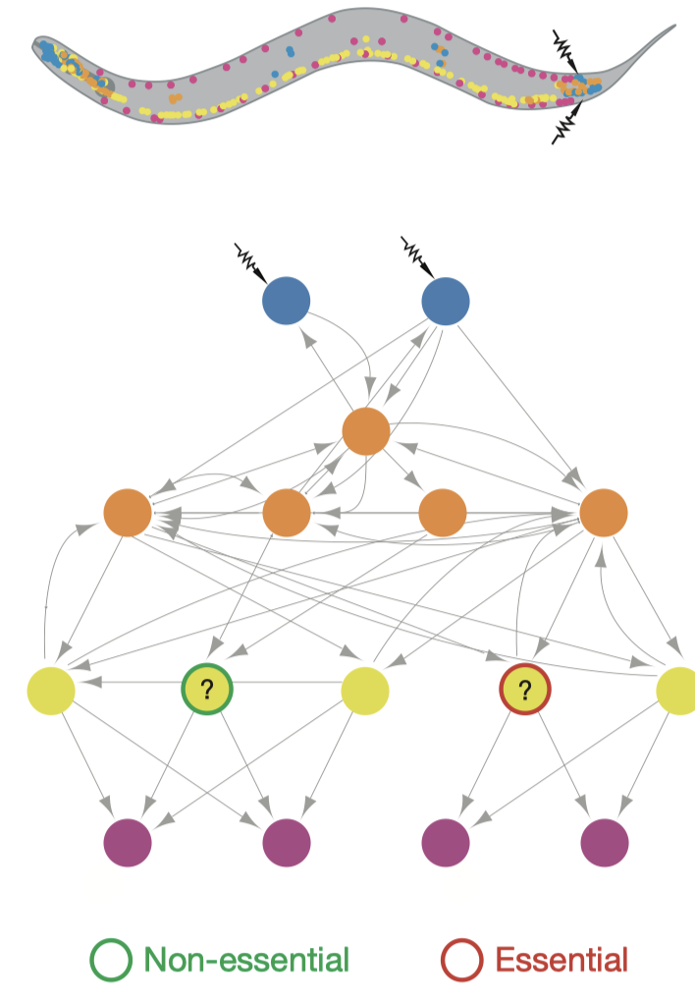

# PHYS3888 Assignment: Research Paper Summary

### Assessment Details

* 1500 words
* Worth 10%
* Due 2 weeks after the final PHYS3888 theory component (Week 8).

### Description

Please see Canvas for details of the assignment.
Be careful to check the assessment structure and criteria, which are focused on your ability to understand the contribution of physics methods to a wide range of problems.
Note in particular that _you do not need a deep understanding of the paper's technical details to do well on this assignment_.

Highly recommended to read the Nature Reviews Physics Perspective: [Taking census of physics](https://www.nature.com/articles/s42254-018-0005-3).

# List of Suggested Research Papers

Here is a list of suggested physics research papers that you might like to select as your featured paper for the PHYS3888 assignment.

### Structure and tie strengths in mobile communication networks (2017)

> "social networks are robust to the removal of the strong ties but fall apart after a phase transition if the weak ties are removed"

Onnela et al.
PNAS (2017).

[Link to article](https://doi.org/10.1073/pnas.0610245104).

---

### History of art paintings through the lens of entropy and complexity (2018)

> Our research shows that simple physics-inspired metrics that are estimated from local spatial ordering patterns in paintings encode crucial information about the artwork. We present numerical scales that map well to canonical concepts in art history and reveal a historical and measurable evolutionary trend in visual arts. They also allow us to distinguish different artistic styles and artworks based on the degree of local order in the paintings.

Sigaki et al. PNAS __115__, 201800083 (2018).
[Link to article](https://dx.doi.org/10.1073/pnas.1800083115).

---

### Spreading of memes through physics literature (2014)

Can you automatically find new ideas in physics that propagate across different scientific papers?

> "The 50 terms from the APS archive with the highest propagation scores included many plausible meme candidates, such as “loop quantum cosmology” (#1) and “carbon nanotubes” (#6), as well as several chemical formulas, including MgB2 (#7; a well-known superconductor)."

__Inheritance Patterns in Citation Networks Reveal Scientific Memes__
Tobias Kuhn, Matjaž Perc, and Dirk Helbing
Phys. Rev. X 4, 041036 (2014).

[Link to article](https://doi.org/10.1103/PhysRevX.4.041036).
A summary article is [here](https://physics.aps.org/articles/v7/118).

---

### On the growth and form of cortical convolutions (2016)

> "We use magnetic resonance images to build a 3D-printed layered gel mimic of the developing smooth fetal brain; when immersed in a solvent, the outer layer swells relative to the core, mimicking cortical growth."

Tallinen et al.
Nature Physics.

[Link to article](dx.doi.org/10.1038/nphys3632)

---

### Detecting concepts by analyzing the dictionary as a graph (2012)

> "techniques from physics and graph theory could be a valuable forensic tool for uncovering the deeper workings of human communication and the evolution of language"

__Loops and Self-Reference in the Construction of Dictionaries__
David Levary, Jean-Pierre Eckmann, Elisha Moses, and Tsvi Tlusty
Phys. Rev. X 2, 031018 (2012).

[Link to paper](https://doi.org/10.1103/PhysRevX.2.031018).
[Link to summary article](https://physics.aps.org/synopsis-for/10.1103/PhysRevX.2.031018)

---

### Identification of influential spreaders in complex networks (2010)

> "the most efficient spreaders are those located within the core of the network as identified by the k-shell decomposition analysis"

> "when multiple spreaders are considered simultaneously the distance between them becomes the crucial parameter that determines the extent of the spreading"

Kitsak et al.
Nature Physics (2010).

[Link to paper](https://www.nature.com/articles/nphys1746).

---
---

# Extra options (more challenging)

### New evidence for brain criticality (2019)

Do the brain's dynamics and function exploit criticality?

> In experiments, they find that rat brains go through a critical point as the brains switch between states with different kinds of neuronal behavior. The team’s results could help narrow down the mechanisms underpinning the brain’s critical point.

__Criticality between cortical states__
Fontenele et al.
Phys. Rev. Lett. 122, 128301 (2019).

[Link to article](https://doi.org/10.1103/PhysRevLett.122.208101).
[Overview summary](https://physics.aps.org/synopsis-for/10.1103/PhysRevLett.122.208101).

---

### A phase transition in language learning (2019)

How do children learn the complex structure of language?

> "Physicist Eric DeGiuli of the École Normale Supérieure in Paris proposes that CFGs can be treated as if they are physical objects, with a “surface” consisting of all possible arrangements of words into sentences, including, in principle, nonsensical ones. His idea is that children instinctively deduce the “deep” grammar rules as they are exposed to the tree’s “surface” (sentences they hear). Learning the rules that allow some sentences but not others, he says, amounts to the child assigning weights to the branches and constantly adjusting these weights in response to the language she hears. Eventually, the branches leading to ungrammatical sentences acquire very small weights, and those sentences are recognized as improbable. These many word configurations, DeGiuli says, are like the microstates in statistical mechanics—the set of all possible arrangements of a system’s constituent particles."

---

__Random Language Model__
E. DeGiuli
Phys. Rev. Lett. 122, 128301 (2019).

[Link to article](https://doi.org/10.1103/PhysRevLett.122.128301).
[Overview summary](https://physics.aps.org/articles/v12/35).

---

### Network control principles predict neuron function in the Caenorhabditis elegans connectome (2018)

> apply a control framework to the connectome of the nematode Caenorhabditis elegans, allowing us to predict the involvement of each C. elegans neuron in locomotor behaviours

[Link to article](https://www.nature.com/articles/nature24056)

---

### Spatial evolution of human dialects (2017)

Language boundaries are driven by surface tension.
An example of using physical ideas to understand how human dialects are distributed through space.

> "Boundaries of language dialect regions are controlled by a length minimizing effect analogous to surface tension, mediated by variations in population density which can induce curvature, and by the shape of coastline or similar borders"

James Burridge. Phys. Rev. X 7, 031008 (2017).

[Link to article](https://doi.org/10.1103/PhysRevX.7.031008).
[Overview summary](https://physics.aps.org/articles/v10/80).

---

### Long-range correlations in nucleotide sequences (1992)

> We uncover in the nucleotide sequence a remarkably long-range power-law correlation that implies a new scale-invariant property of DNA

Peng et al.
Nature (1992).

[Link to paper](https://www.nature.com/articles/356168a0).

---

### Stretching an elastic loop (2016)

> "Loop tightening leads to one of three outcomes: a crease, a pop-out, or a twist. The final shape is a competition between bending and stretching forces."

__Stretching an Elastic Loop: Crease, Helicoid, and Pop Out__
Yasuaki Morigaki, Hirofumi Wada, and Yoshimi Tanaka
Phys. Rev. Lett. 117, 198003 (2016).

[Link to article](https://doi.org/10.1103/PhysRevLett.117.198003).
[Overview summary](https://physics.aps.org/synopsis-for/10.1103/PhysRevLett.117.198003)

---

### Brain motion under impact (2018)

> We showed that the brain’s deformation is most sensitive in low frequency regimes close to 30 Hz, and discovered that for most subconcussive head impacts, the dynamics of brain deformation is dominated by a few low-frequency, damped modes of vibration in brain tissue. This finding could inform the design of sports helmets.

__Mechanistic Insights into Human Brain Impact Dynamics through Modal Analysis__
Kaveh Laksari, Mehmet Kurt, Hessam Babaee, Svein Kleiven, and David Camarillo
Phys. Rev. Lett. 120, 138101 (2018).

[Link to article](https://doi.org/10.1103/PhysRevLett.120.138101).
[Overview summary](https://physics.aps.org/articles/v11/32).

---

### Fluid interactions help fish in a school swim faster (2018)

> "what could look like a consequence of behavior—the 'free will' of the fish, you might say—is here actually a result of the fluid dynamics"

__Model of Collective Fish Behavior with Hydrodynamic Interactions__
Audrey Filella, François Nadal, Clément Sire, Eva Kanso, and Christophe Eloy
Phys. Rev. Lett. 120, 198101 (2018).

[Link to article](https://doi.org/10.1103/PhysRevLett.120.198101).
[Overview summary](https://physics.aps.org/articles/v11/46).

---

### Physics of spreading disease processes in the brain (2018)

Computer simulations of the diffusion and aggregation of harmful proteins in the brain reproduce the pattern of damage seen in neurodegenerative diseases.

> The harmful proteins are known to travel preferentially through the network of nerve cells (neurons) in the brain, rather than through the fluid outside of cells.

__Multiphysics of Prionlike Diseases: Progression and Atrophy__
Johannes Weickenmeier, Ellen Kuhl, and Alain Goriely
Phys. Rev. Lett. 121, 158101 (2018).

[Link to article](https://doi.org/10.1103/PhysRevLett.121.158101).
[Overview summary](https://physics.aps.org/articles/v11/104).
